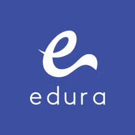
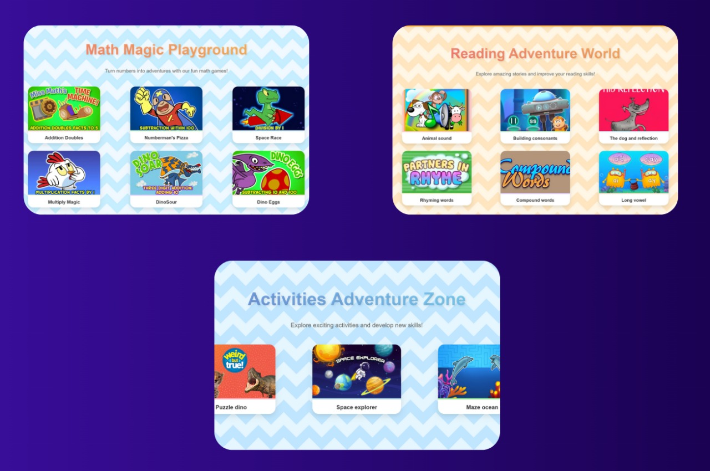
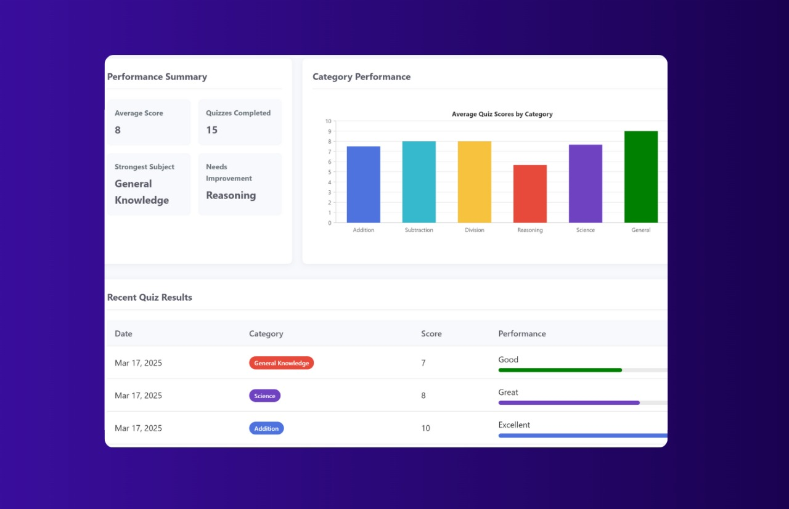
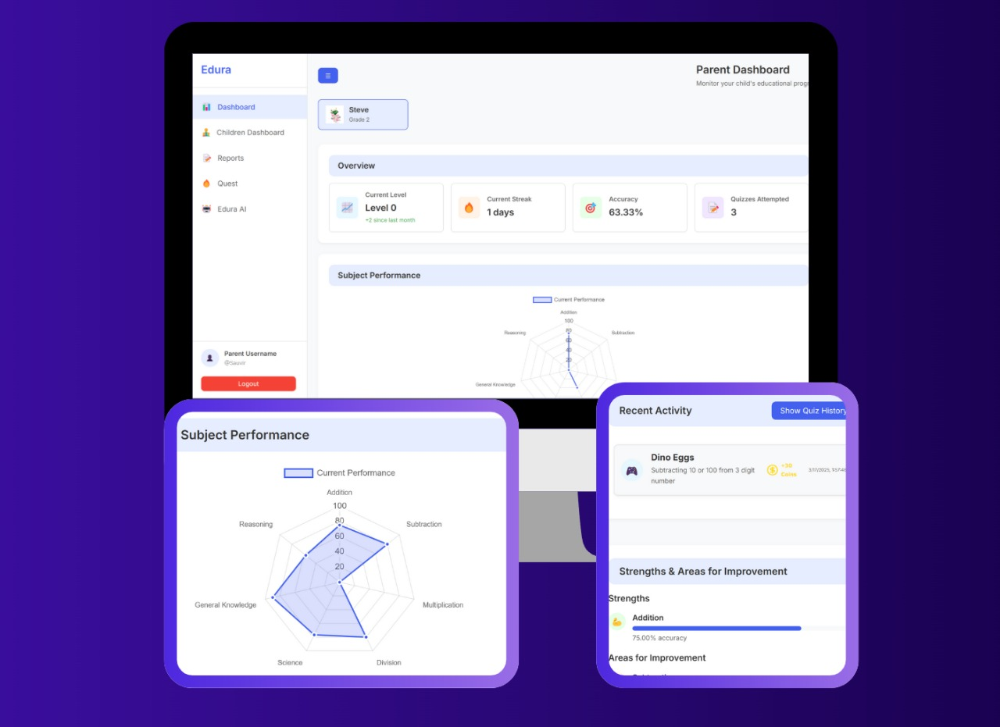
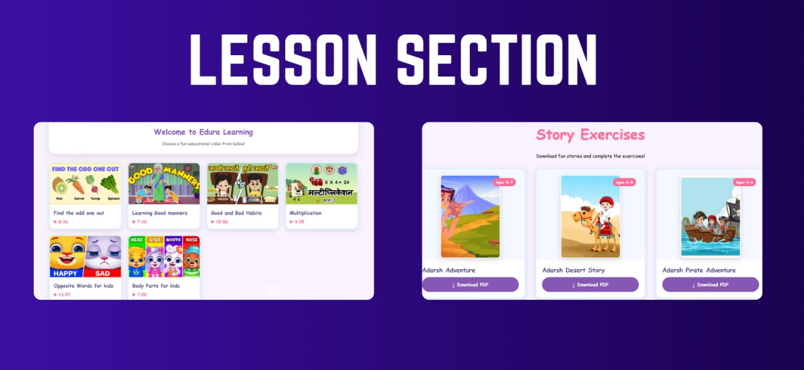
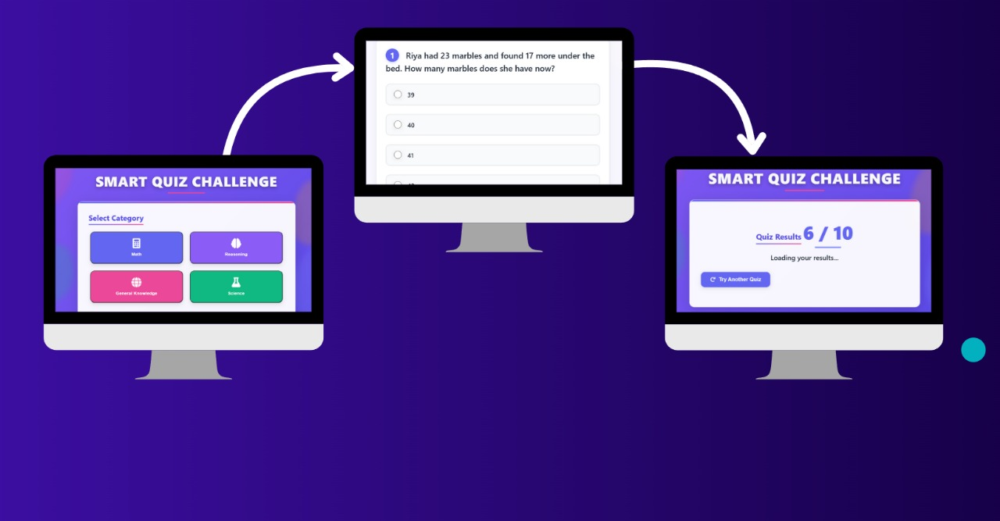

# Edura - Hack To Crack 2.0 Hackathon Project




## 🏆 Hack To Crack 2.0 Submission

This project was developed as part of the **Hack To Crack 2.0** hackathon. Edura is a comprehensive interactive learning platform designed to bridge the educational needs of both children and parents, making education more engaging, personalized, and measurable.

## 💡 Problem Statement

# Gamified learning Platform for kids :-

Traditional educational platforms often focus solely on either children's learning experience or parental monitoring, creating a disconnect between learning and oversight. Edura solves this by providing:

1. An engaging and gamified learning environment for children that encourages consistent participation
2. Comprehensive analytics and support tools for parents to monitor and guide their children's educational journey
3. Ensures kids participation and engagement with its unique tools and features 

## 🌟 Features

### For Children
- **Interactive Learning Games** focused on math, Reading , communication  and reasoning
- **Activity Zone** helps kids gain knowledge about various topics via different activities
- **Daily Streak System** to encourage consistent learning habits with streak alerts( if streak missed)
- **Quiz Feature** to test their knowledge in different categories
- **Personalized Dashboards** showing progress and achievements , history and learning 
- **Personalized Learning Roadmaps** generated through performance analysis ,  based on the average scores of quiz 
- **Coin Rewards & Avatar System** to motivate continued participation 
- **Super Kid Image Detective** - a fun tool that identifies objects and provides educational information to curious kids and keeps them engaged in exploring new things
- **Multiplayer Quiz Rooms** for competitive learning with friends
- **lessons** Video lectures regarding various topics and categories
- **Downloadable comics and puzzle books** to keep kids evolve their problem solving skills

### For Parents
- **Comprehensive Dashboard** with detailed performance analytics
- **Progress Visualization** through interactive graphs and charts and histograms
- **Detailed Reports** on child's learning journey , detailed analysis of weak and strong areas
- **Parent Assistant Chatbot** for guidance and support in their child learning journey
- **Multiplayer Quest** Parents can create multiplayer quests for thir kids and view and analyze their results
- **Parental Login System** for creating accounts for themselves and their children

## 🛠️ Technology Stack

- **Frontend**: HTML, CSS, JavaScript
- **Data Visualization**: Chart.js
- **AI Integration**: Gemini API
- **Backend**: Spring Boot, Spring MVC

## 📊 Demo & Presentation

- [View Demo](https://your-demo-link.com) *(Coming Soon)*
- [Presentation Slides](https://your-slides-link.com) *(Coming Soon)*

## 🚀 Quick Start

1. Clone the repository
   ```bash
   git clone https://github.com/your-org/edura-hackathon.git
   cd edura-hackathon
   ```

2. Set up the backend
   ```bash
   cd backend
   ./mvnw clean install
   ```

3. Configure the Gemini API key
   ```bash
   cp .env.example .env
   # Edit .env file and add your Gemini API key
   ```

4. Run the application
   ```bash
   ./mvnw spring-boot:run
   ```

5. Open your browser and navigate to `http://localhost:8080`

## 👥 Team Members

- **Anmol Upadhyay** - Team Leader & UI/UX Designer
- **Vikas Kumar** - UI/UX Designer
- **Sauvir Wodehra** - Data Binder and Tester
- **Adarsh Dubey** - Backend Developer

## 📷 Screenshots








## 🔮 Future Scope

# If developed beyond the hackathon, Edura plans to implement:
- Expanded subject to extra curricular Activities
- Community features for parents to share experiences and tips
- Host seasonal events and team based games

## 💬 Feedback

This project was created in a limited timeframe for Hack To Crack 2.0. We welcome all feedback and suggestions to improve our platform!

---

Made with ❤️ and ☕ during Hack To Crack 2.0
